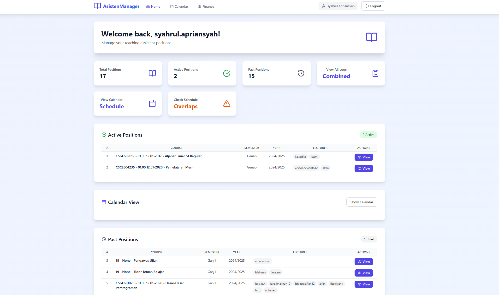

# AsistenManager

AsistenManager is a comprehensive web application designed to help teaching assistants manage their schedules, logs, and financial records efficiently. It provides a modern, intuitive interface for tracking teaching activities, managing multiple courses, and monitoring payments. This application wraps the web Siasisten, making it specifically tailored for students of the Faculty of Computer Science, Universitas Indonesia.



## Features

- **Dashboard Overview**: Get a quick glance at all your teaching positions, both active and past
- **Activity Logging**: Create and manage detailed logs for your teaching activities
- **Calendar View**: Visualize your schedule in a calendar format
- **Schedule Overlap Detection**: Can detect and warn about overlapping schedules
- **Financial Tracking**: Monitor your teaching assistant payments and statuses
- **Multi-Course Support**: Handle multiple courses simultaneously
- **Real-time Status Updates**: Track the approval status of your activity logs
- **Responsive Design**: Access the application seamlessly across different devices

## Getting Started

### Prerequisites

- Node.js (v18 or higher)
- npm (v9 or higher)

### Installation

1. Clone the repository:
```bash
git clone https://github.com/syahrulApr86/asistenmanager.git
cd asistenmanager
```

2. Install dependencies:
```bash
npm install
```

3. Create a `.env` file in the root directory and add your environment variables:
```env
VITE_SUPABASE_URL=your_supabase_url
VITE_SUPABASE_ANON_KEY=your_supabase_anon_key
```

4. Start the development server:
```bash
npm run dev
```

The application will be available at `http://localhost:5173`

### Running with Docker

AsistenManager also supports running via Docker. Follow the steps below:

1. Ensure you have Docker and Docker Compose installed.

2. Clone the repository:
```bash
git clone https://github.com/syahrulApr86/asistenmanager.git
cd asistenmanager
```

3. Create a `.env` file in the root directory and add your environment variables:
```env
VITE_SUPABASE_URL=your_supabase_url
VITE_SUPABASE_ANON_KEY=your_supabase_anon_key
```

4. Build and run the Docker containers:
```bash
docker compose up --build
```

The application will be accessible at `http://localhost:5173`. The backend (if any) can be accessed at `http://localhost:3001`.

## Technology Stack

- **Frontend**: React, TypeScript, Vite
- **Styling**: Tailwind CSS
- **State Management**: React Context
- **Database**: Supabase
- **Calendar**: FullCalendar
- **Charts**: Chart.js
- **Icons**: Lucide React

## Contributing

Contributions are welcome! Please feel free to submit a Pull Request.

## Author

Syahrul Apriansyah

## License

This project is licensed under the MIT License - see the [LICENSE](LICENSE) file for details.
